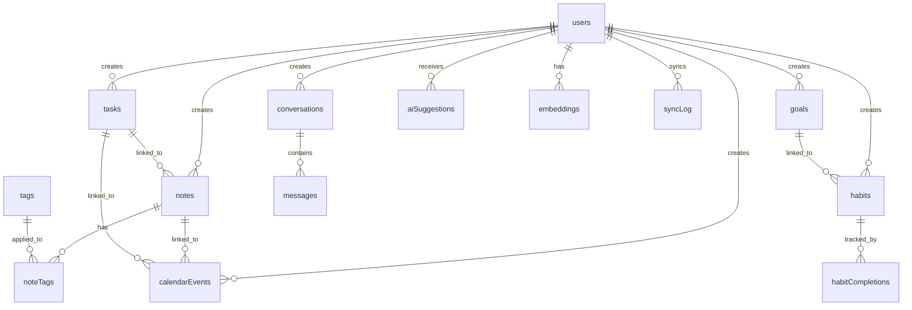

# Arden Database Schema Documentation

## Overview

The Arden database schema is designed to support a comprehensive personal AI assistant with the following core features:
- Intelligent note-taking with AI organization
- Calendar and event management
- Task and reminder systems
- Goal tracking and habit formation
- AI-powered conversations and suggestions
- Semantic search capabilities
- Cross-device synchronization

## Entity Relationship Diagram

## Core Tables

### User Management
- **users**: Core user information and authentication
- **oauthAccounts**: OAuth provider details (Google, Apple)
- **profile**: Extended user profile and preferences
- **userActivity**: Audit log of user actions

### Content Management
- **notes**: Rich text notes with AI analysis
- **tags**: Categorization system for notes
- **noteTags**: Many-to-many relationship between notes and tags
- **calendarEvents**: Calendar events and appointments
- **tasks**: Task management with priorities and due dates

### Goal & Habit Tracking
- **goals**: Long-term objectives with progress tracking
- **habits**: Recurring behaviors with streak tracking
- **habitCompletions**: Daily habit completion records

### AI Features
- **conversations**: Chat session management
- **messages**: Individual chat messages and AI responses
- **aiSuggestions**: AI-generated recommendations and nudges
- **embeddings**: Vector embeddings for semantic search

### Infrastructure
- **syncLog**: Cross-device synchronization tracking

## Key Design Decisions

### 1. Hierarchical Relationships
- Notes can have parent notes (threads/replies)
- Tasks can have subtasks (parent_task_id)
- Goals can have sub-goals (parent_goal_id)

### 2. Cross-Linking
- Notes can link to calendar events
- Tasks can link to both notes and calendar events
- Habits can link to goals for progress alignment

### 3. AI Integration
- AI-generated summaries and keywords in notes
- AI coaching notes in goals
- Separate suggestions table for proactive AI assistance
- Vector embeddings for semantic search across all content

### 4. Temporal Data
- All entities have created_at and updated_at timestamps
- Calendar events support recurrence rules
- Tasks support recurring patterns
- Habit completions track daily/weekly patterns

### 5. Privacy & Security
- All user data is properly isolated by user_id
- Cascade deletes ensure clean data removal
- Embeddings are anonymized for AI processing

## Indexing Strategy

### Performance Indexes
- User-based filtering: `user_id` indexes on all user data
- Temporal queries: `created_at`, `due_date`, `start_time` indexes
- Status filtering: `is_completed`, `is_active`, `status` indexes

### Search Optimization
- Tag-based search: `user_id + name` on tags
- Content search: `content_type + content_id` on embeddings
- Sync operations: `entity_type + entity_id` on sync_log

## Data Types and Constraints

### Text Fields
- IDs: Text-based UUIDs for better distribution
- Timestamps: Numeric ISO strings for consistent timezone handling
- JSON: Text fields for flexible metadata storage

### Boolean Fields
- Stored as integers (0/1) for SQLite compatibility
- Clear naming: `is_completed`, `is_pinned`, `is_archived`

### Enums
- Priority: 'low', 'medium', 'high', 'urgent'
- Status: 'active', 'completed', 'paused', 'archived'
- Frequency: 'daily', 'weekly', 'monthly'

## Future Considerations

### Scalability
- Partition strategy for large datasets
- Archive strategy for old data
- Read replicas for analytics

### Features
- File attachments table
- Collaboration features (shared notes/goals)
- Integration with external services
- Advanced analytics and reporting

### Performance
- Full-text search implementation
- Caching strategy for frequently accessed data
- Optimistic concurrency control 